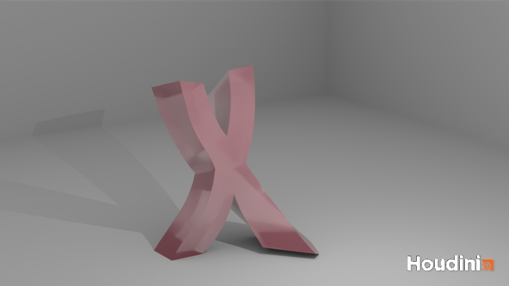

# Wiggly: Animating Deformable Objects Using Spacetime Constraints
University of Pennsylvania, CIS 660: Advanced Topics in Computer Graphics

[Wayne Wu](https://www.wuwayne.com/) and Aditya Abhyankar

## Installation
To use the tools without building, simply copy the `dso`, `config`, `otls`, `help` folders to your HOUDINI_USER_PREF_DIR.

## Build Instruction

### Dependencies
* [cmake](https://cmake.org/)
* [dlib](http://dlib.net/)

1. Download the dependencies listed above.
2. Modify `src/CMakeLists.txt` to point to YOUR Houdini and dlib paths.
3. Generate VS solution using cmake/cmake-gui

Overview
============
This project implements the paper: [Animating deformable objects using sparse spacetime constraints](https://dl.acm.org/doi/10.1145/2601097.2601156) by Schulz et al. in Houdini. As part of the authoring tool, we have designed an intuitive workflow that allows users to easily create the sparse keyframes and generate animation with our custom solver.

Implementation
=============
The core algorithm of the paper is implemented in C++ using HDK. The node is implemented as a SOP node based on the NodeVerb design.

We use the Eigen3 library for most of the linear algebra operations, most importantly for using the Generalized Eigen Solver and SVD operation. We use dlib for its optimization algorithm, as it was the only third-party library we found to work with Windows and fit our needs. While the paper uses Gauss Newton method, we use the BFGS algorithm with approximated derivatives. Finally, we are using a brute-force trapezoidal rule to evaluate the integral of the energy term, instead of using explicit integral formulas.

For efficiency, we've implemented multi-threading for many functions using HDK's UT_ThreadedAlgorithm. Specifically, we've parallelized the evaluation of wiggly splines for each mode (i.e. reduced dimension), as the evaluation is largely independent. This provided at least a 3X performance gain.

Workflow
============
We introduce three new SOP nodes to support the workflow:

### Wiggly Constraint SOP
This is used to define a single spacetime constraint with position and/or velocity data.
You can either transform points directly using the node parameters, or you can use a Transform SOP that then goes into the Wiggly Constraint SOP. 
What's important is for the vertices to be at the position of the constraint.

### Wiggly Spline SOP
This is used to define a motion that contains a sparse set of spacetime constraints (a.k.a Wiggly Constraints).
It is simply a configuration node that groups the constraints together as part of one Wiggly Spline (i.e. one motion).
You should also specify the pin constraints here if you'd like to fix any part of the mesh.

### Wiggly Solver SOP
This is used to run the optimization process and generate the animation. It will take in the Wiggly Splines, which contain the Wiggly Constraints.
Each Wiggly Spline will be solved iteratively and the splines will be made continuous as one smooth motion.

We're also using the Guide Geometry to allow users to easily see the final animation and the specified constraints together.
Here's what it would look like in the viewport:

https://user-images.githubusercontent.com/77313916/166610640-701600c4-1e61-4b5f-b66c-04f075d94200.mp4

Results
=============
Results are rendered using Karma XPU.

https://user-images.githubusercontent.com/77313916/166608866-8cc58a6a-b376-4f75-8acc-980747a00667.mp4

https://user-images.githubusercontent.com/77313916/166608907-c0b80a43-c4e9-4e96-ae34-7ca518a7e551.mp4

https://user-images.githubusercontent.com/77313916/166608956-3ee970b3-c535-4b7c-805e-a370f0d4ca37.mp4

https://user-images.githubusercontent.com/77313916/166609020-d6db6f87-c10a-4958-b53d-3d3fbfb74e93.mp4

https://user-images.githubusercontent.com/77313916/166609026-21c64f82-2237-46d2-bcf7-85fe2caa26f6.mp4

Future Work
==============
* Implement rotation strain warping
* Use explicit integral when evaluating the energy function
* Compare other optimization techniques
* Create viewport handle for Wiggly Constraint SOP
* Performance optimization
* Remove third-party dependencies

Special Thanks To
=================
* Cameron White - SideFX
* Prof. Klaus Hildebrandt - TU Delft
